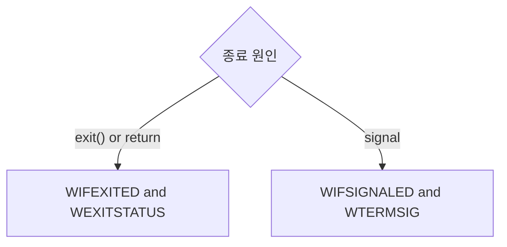

pid_t wait(int *status) 에 status 에 담겨있다.

WIFEXITED(status) : exit 이나 return에 의해 종료되었으면, true
  이때, WEXITSTATUS(status) 로 종료값을 알 수 있다.
WIFSIGNALED(status) : signal 에 의해 종료되었으면, true
   WTERMSIG(status) 로 signal을 알 수 있다.